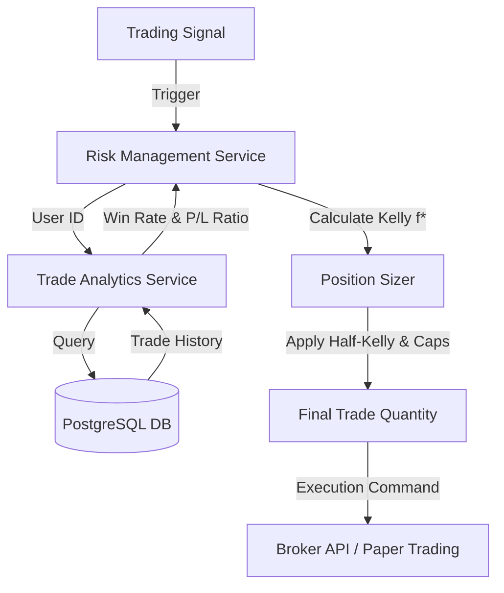

# 🧮 Kelly Criterion Risk Engine: Institutional-Grade Position Sizing

## 1. Overview
The **Kelly Criterion Risk Engine** is a sophisticated risk management module that replaces fixed-lot trading with a mathematically optimal position sizing strategy. By analyzing historical performance (Win Rate and Profit Factor), the engine dynamically adjusts the capital allocated to each trade to maximize long-term growth and eliminate the "Risk of Ruin."

---

## 2. Theoretical Foundation
The engine implements the standard Kelly Formula:

$$f^* = \frac{p \cdot b - q}{b}$$

Where:
*   **$f^*$**: The fraction of the portfolio to wager.
*   **$p$**: The probability of a win (Win Rate).
*   **$b$**: The win/loss ratio (Average Profit / Average Loss).
*   **$q$**: The probability of a loss ($1 - p$).

### The "Half-Kelly" Margin of Safety
In production, we use a **0.5 multiplier (Half-Kelly)**. This reduces volatility and provides a buffer against "black swan" events or statistical errors in performance data.

---

## 3. System Architecture



### Key Components:
1.  **Analytics Layer:** Pulls raw trade data from `AutoTradeExecution` table.
2.  **Logic Layer:** Computes the fractional edge based on the last $N$ trades.
3.  **Safety Layer:** Enforces hard constraints (Min 1%, Max 10% capital per trade).

---

## 4. How it Works (Step-by-Step)

### Step 1: Performance Extraction
The engine calls `TradeAnalyticsService.get_overall_performance()`. It requires at least **10 closed trades** to build a statistically significant profile.

### Step 2: The "Edge" Calculation
If a user has a **60% Win Rate** and a **2:1 Reward-to-Risk ratio**:
*   $p = 0.60$
*   $b = 2.0$
*   $q = 0.40$
*   $Kelly\ f^* = (0.60 * 2 - 0.40) / 2 = 0.40$ (40% of capital)

### Step 3: Risk Normalization
The engine applies the **Half-Kelly** rule and hard caps:
*   $Safe\ Kelly = 0.40 * 0.5 = 0.20$ (20%)
*   $Hard\ Cap = 10\%$
*   **Final Result:** 10% of available capital used for the trade.

---

## 5. Technical Implementation Details

*   **File Path:** `services/risk_management_service.py`
*   **Key Method:** `calculate_kelly_fraction(user_id, db)`
*   **Dependencies:** `SQLAlchemy`, `TradeAnalyticsService`

### Configuration Variables
| Variable | Value | Purpose |
| :--- | :--- | :--- |
| `kelly_fraction_multiplier` | 0.5 | Half-Kelly safety factor |
| `min_kelly_fraction` | 0.01 | Minimum 1% risk floor |
| `max_kelly_fraction` | 0.10 | Maximum 10% risk ceiling |

---

## 6. How to Set Up & Run

### Prerequisites
1.  **Trade History:** Ensure you have at least 10 entries in the `auto_trade_executions` table with status `CLOSED`.
2.  **Capital Setup:** Ensure the `paper_trading_accounts` table has an `available_balance` set.

### Activation
The Kelly Engine is integrated into the `calculate_position_size` method. To use it, simply pass the `user_id` and `db` session:

```python
# Usage Example
risk_engine = RiskManagement()
qty = risk_engine.calculate_position_size(
    option_price=150.0,
    volatility=0.02,
    available_capital=100000.0,
    user_id=1,
    db=db_session
)
print(f"Optimal Quantity: {qty} lots")
```

---

## 7. Business Impact
*   **Lower Churn:** Users stay longer because the bot automatically "scales down" during losing streaks, preventing account blowouts.
*   **Higher ROI:** The bot "scales up" when the strategy has a high win rate, capturing maximum profit during winning streaks.
*   **Marketing Edge:** Positions your bot as a "Quantitative Hedge Fund" tool rather than a simple indicator-based bot.
