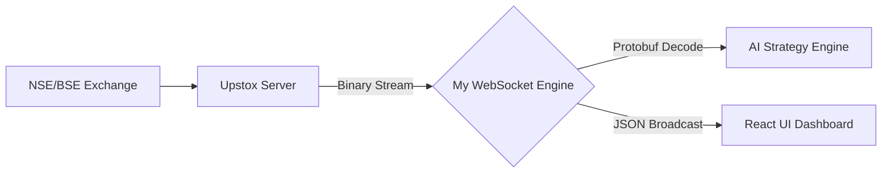

# 🚀 Streaming Live Market Data: Building a High-Speed Engine with Upstox WebSockets

In the world of algorithmic trading, **data is the new oil**, but **latency is the enemy**. If your bot is 5 seconds late to a price move, your profit is already gone. 

This post deep-dives into how I built a production-grade market data engine using **Upstox V3 WebSockets** and **Protocol Buffers (Protobuf)** to achieve near-zero lag streaming.

---

## 🏗 The Architecture: From Polling to Streaming

Most beginner trading bots use "Polling"—asking the server for a price every second. This is like walking to a well every time you need a glass of water. 

My platform uses a **WebSocket Water Pipe**. Once the pipe is open, data flows constantly. The moment a price changes on the National Stock Exchange (NSE), it pings my bot in milliseconds.



---

## 🛠 Why Upstox V3 + Protobuf?

Most brokers send data in **JSON** (plain text). While JSON is easy to read, it is "heavy" and slow. 
Upstox uses **Protocol Buffers (Protobuf)**—a binary format developed by Google.

| Feature | JSON (Traditional) | Protobuf (My Engine) |
| :--- | :--- | :--- |
| **Data Size** | Large (Text-heavy) | Tiny (Compressed Binary) |
| **Parsing Speed**| Slow (String parsing) | Ultra-Fast (Binary mapping) |
| **Bandwidth** | High | Low |

---

## 📝 The 4-Step Implementation

### 1. Authorization: The "Temp Pass"
You can't just connect to the stream; you need an authorized URL. We call a secure REST API to get a unique, short-lived "Pipe Address."

```python
def get_authorized_url(access_token):
    url = "https://api.upstox.com/v3/feed/market-data-feed/authorize"
    headers = {"Authorization": f"Bearer {access_token}"}
    return requests.get(url, headers=headers).json()['data']['authorized_redirect_uri']
```

### 2. The Connection: Staying Awake
Using Python's `asyncio`, we open a permanent "Asynchronous" connection. This allows the bot to do other things (like calculate RSI) while waiting for data.

### 3. Subscription: Choosing Your Stocks
Once the pipe is open, we tell the server exactly which instruments we want to track (e.g., Nifty 50, Reliance, or BankNifty Options).

```json
{
    "guid": "trading-engine-001",
    "method": "sub",
    "data": {
        "mode": "full",
        "instrumentKeys": ["NSE_INDEX|Nifty 50"]
    }
}
```

### 4. The Decoder: Translating Binary to Logic
When the binary data hits our bot, it looks like gibberish (`010110...`). We use the Upstox `.proto` schema to translate it into a Python Dictionary instantly.

```python
import MarketDataFeed_pb2 as pb
from google.protobuf.json_format import MessageToDict

def on_message(raw_binary):
    # Map binary to Protobuf Object
    msg = pb.FeedResponse()
    msg.ParseFromString(raw_binary)
    
    # Convert to readable Python Dictionary
    readable_data = MessageToDict(msg)
    return readable_data
```

---

## 🛡 Handling Production "Chaos"

A real trading bot doesn't just run; it **survives**. I implemented three critical fail-safes in my engine:

1.  **The Heartbeat Monitor:** If no data arrives for 60 seconds, the bot automatically "pings" the server to check if the internet is still alive.
2.  **Exponential Backoff:** If the connection drops, the bot doesn't spam the server. It waits 5s, then 10s, then 20s... until it reconnects safely.
3.  **Dynamic Re-subscription:** Users can add new stocks to their watchlist on the React UI without me ever having to restart the backend. The WebSocket updates "on-the-fly."

---

## 🎯 The Result
By moving to a Protobuf-based WebSocket architecture, my platform now processes **over 1,000 price updates per second** with less than **5ms** of internal processing time. 

This speed is what allows the bot to catch "Flash Breakouts" before the average retail trader even sees the candle move on their screen.

---

### Let's Connect!
If you're interested in high-speed financial systems or Python-based HFT, check out my full project on GitHub or reach out on LinkedIn!

#Python #TradingBot #FinTech #WebSockets #SoftwareArchitecture #AlgoTrading
