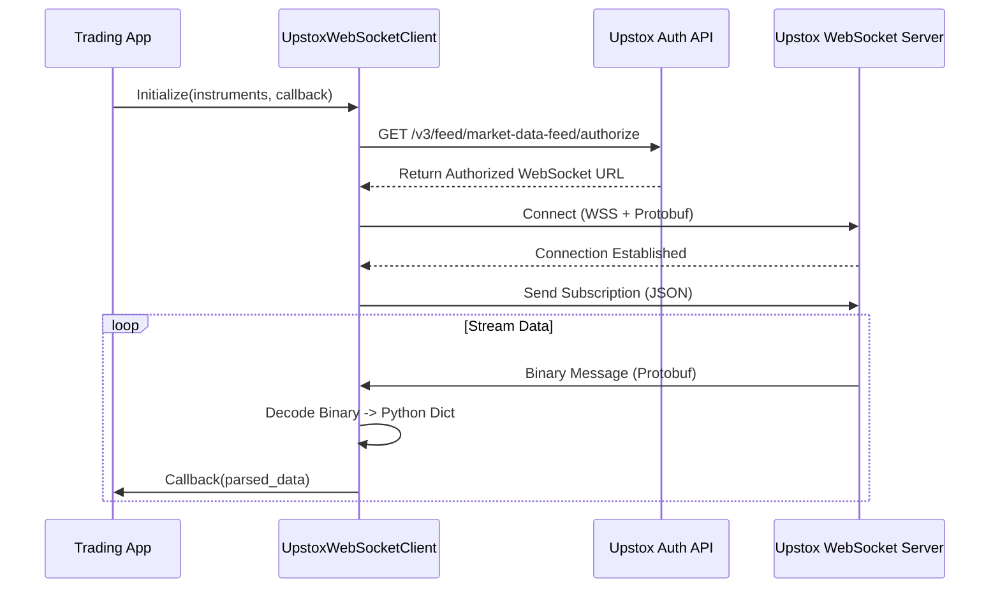

# 📡 Upstox Real-Time Market Data: WebSocket Implementation Guide

## 1. Overview
This module provides a robust, low-latency WebSocket client for fetching real-time market data (LTP, Quotes, Market Depth, and Greeks) from the **Upstox V3 API**. It uses **Binary Protobuf** encoding for maximum efficiency and supports dynamic re-subscription without connection drops.

---

## 2. Architecture & Data Flow



---

## 3. Key Concepts

### A. Binary Protobuf Encoding
Unlike many brokers that send JSON over WebSockets, Upstox uses **Protocol Buffers**. This significantly reduces bandwidth and parsing CPU time. Our client uses the `MarketDataFeed_pb2.py` generated classes to decode these high-speed streams.

### B. Dual-Layer Decoding
1.  **Binary Layer:** The raw buffer is parsed into a Protobuf object.
2.  **Dictionary Layer:** The object is converted into a standard Python `dict` using `google.protobuf.json_format` for easy handling by the strategy engine.

### C. Connection Types
*   **`dashboard`**: Optimized for "LTP Only" updates (Lower bandwidth).
*   **`trading` / `centralized_admin`**: Full market depth, volume, and **Options Greeks** (Delta, Gamma, Theta).

---

## 4. Technical Implementation

*   **File Path:** `services/upstox/ws_client.py`
*   **Protobuf Schema:** `services/upstox/MarketDataFeed.proto`
*   **Main Class:** `UpstoxWebSocketClient`

### Core Methods:
| Method | Description |
| :--- | :--- |
| `connect_and_stream()` | Manages auth, connection, and the main data loop. |
| `_send_subscription()` | Sends the initial or updated list of instrument keys. |
| `update_subscriptions()`| Adds/Removes keys at runtime without reconnecting. |
| `_process_market_status()`| Detects market opening/closing phases (NSE/BSE). |

---

## 5. How to Run & Use

### Prerequisites
1.  Valid **Upstox Access Token** (stored in `BrokerConfig` DB).
2.  List of **Instrument Keys** (e.g., `NSE_INDEX|Nifty 50`).

### Usage Example
```python
from services.upstox.ws_client import UpstoxWebSocketClient

async def my_callback(data):
    print(f"Received Tick: {data}")

client = UpstoxWebSocketClient(
    access_token="YOUR_TOKEN",
    instrument_keys=["NSE_EQ|INE002A01018"],
    callback=my_callback,
    connection_type="trading"
)

# Run in event loop
await client.connect_and_stream()
```

---

## 6. Advanced Features

### 🚀 Dynamic Re-subscription
The client calculates the `set` difference between current and new keys. It only sends `unsub` for removed keys and `sub` for new ones, ensuring the stream never pauses.

### 🛡 Fault Tolerance
*   **Auto-Retry:** Implements exponential backoff (5s, 10s, 20s... up to 60s).
*   **Health Check:** Sends a manual WebSocket **Ping** if no data is received for 60 seconds.
*   **Auth Monitoring:** Detects `403 Forbidden` errors and triggers the `on_auth_error` callback to refresh tokens.

---

## 7. Business Value
*   **Zero-Lag Execution:** Essential for the **SignalHive** MRR tier where signals must be delivered in milliseconds.
*   **Options Edge:** Fetches real-time **IV and Greeks**, allowing the **Options Greek Screener** to work with high precision.
*   **Reliability:** The robust error handling allows you to sell **Managed Hosting** with a 99.9% uptime guarantee.
