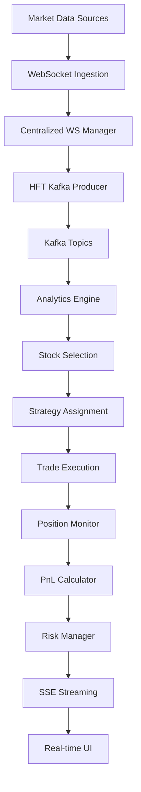

# Data Flow Architecture

## Overview

This document describes the complete data flow through the Auto Trading System, from market data ingestion to real-time UI updates. The system processes high-frequency market data through multiple stages with sub-millisecond latency requirements.

## High-Level Data Flow



## Detailed Data Flow Stages

### Stage 1: Market Data Ingestion

#### Data Sources
- **Upstox WebSocket**: Primary F&O data feed
- **Angel One WebSocket**: Secondary data feed
- **NSE API**: Options chain data
- **Dhan API**: Additional market data

#### Data Format (Upstox Live Feed)
```json
{
  "type": "live_feed",
  "feeds": {
    "NSE_EQ|INE318A01026": {
      "fullFeed": {
        "marketFF": {
          "ltpc": {
            "ltp": 3097.7,
            "ltt": "1757308567467",
            "ltq": "1",
            "cp": 3095.1
          },
          "marketLevel": {
            "bidAskQuote": [
              {
                "bidQ": "1",
                "bidP": 3097.4,
                "askQ": "2", 
                "askP": 3097.9
              }
            ]
          },
          "marketOHLC": {
            "ohlc": [
              {
                "interval": "1d",
                "open": 3094.0,
                "high": 3115.4,
                "low": 3081.0,
                "close": 3097.7,
                "vol": "31929"
              }
            ]
          }
        }
      }
    }
  }
}
```

#### Ingestion Processing
1. **WebSocket Connection**: Maintain persistent connections to data sources
2. **Data Validation**: Validate message format and completeness
3. **Normalization**: Convert to standardized internal format
4. **Deduplication**: Remove duplicate messages
5. **Enrichment**: Add metadata (timestamps, source info)

### Stage 2: Centralized Processing

#### Centralized WebSocket Manager (`services/centralized_ws_manager.py`)

**Responsibilities**:
- Aggregate data from multiple sources
- Manage connection health and failover
- Route data to appropriate processors
- Maintain connection statistics

**Processing Flow**:
```python
# Pseudo-code for data processing
async def process_market_data(raw_data):
    # 1. Validate and parse
    validated_data = validate_market_data(raw_data)
    
    # 2. Normalize format
    normalized_data = normalize_to_standard_format(validated_data)
    
    # 3. Enrich with metadata
    enriched_data = add_metadata(normalized_data)
    
    # 4. Route to Kafka
    await kafka_producer.send(topic="hft.market_data", data=enriched_data)
    
    # 5. Update registries
    await instrument_registry.update_prices(enriched_data)
```

### Stage 3: Kafka Message Streaming

#### Kafka Topics Structure

| Topic | Purpose | Partitions | Retention |
|-------|---------|------------|-----------|
| `hft.market_data` | Raw market data | 10 | 1 hour |
| `hft.analytics.market_data` | Processed analytics data | 5 | 4 hours |
| `hft.analytics.features` | Technical features | 3 | 8 hours |
| `hft.trading.signals` | Trading signals | 5 | 24 hours |
| `hft.trading.executions` | Trade executions | 3 | 7 days |
| `hft.ui.price_updates` | UI-specific updates | 2 | 30 minutes |
| `hft.trading.risk_events` | Risk events | 1 | 7 days |

#### Message Partitioning Strategy

**Market Data Partitioning**:
```python
def partition_key(instrument_key: str) -> str:
    # Distribute by instrument to ensure ordered processing
    return instrument_key

def partition_assignment(key: str, num_partitions: int) -> int:
    # Consistent hashing for even distribution
    return hash(key) % num_partitions
```

**Benefits**:
- **Ordered Processing**: Messages for same instrument processed in order
- **Load Distribution**: Even distribution across partitions
- **Fault Tolerance**: Partition-level redundancy

### Stage 4: Analytics Processing

#### Real-Time Analytics Engine (`services/analytics/real_time_analytics_engine.py`)

**Input**: Kafka topic `hft.analytics.market_data`  
**Processing**: Calculate technical features and analytics  
**Output**: Multiple Kafka topics and SSE channels

**Feature Calculation Pipeline**:
```python
async def process_market_batch(messages: List[Dict]) -> None:
    # 1. Extract market ticks
    market_ticks = extract_market_ticks(messages)
    
    # 2. Calculate features in parallel
    features_tasks = [
        calculate_momentum(tick),
        calculate_volatility(tick),
        calculate_volume_ratio(tick),
        calculate_rsi(tick)
    ]
    features_list = await asyncio.gather(*features_tasks)
    
    # 3. Calculate analytics
    analytics_tasks = [
        calculate_top_movers(features_list),
        calculate_breakouts(features_list),
        calculate_volume_alerts(features_list)
    ]
    analytics_results = await asyncio.gather(*analytics_tasks)
    
    # 4. Publish results
    for result in analytics_results:
        await publish_analytics_result(result)
```

**Calculated Features**:
- **Price Features**: Change %, momentum, volatility
- **Volume Features**: Volume ratio, VWAP, volume profile
- **Technical Indicators**: RSI, MACD, Bollinger Bands
- **Market Microstructure**: Bid-ask spread, order flow

### Stage 5: Stock Selection Process

#### Real-Time Stock Selector (`services/stock_selection/real_time_stock_selector.py`)

**Input**: Analytics features and market data  
**Processing**: Multi-factor scoring and ranking  
**Output**: Selected stocks with strategy assignments

**Selection Algorithm**:
```python
async def select_stocks(features_batch: List[CalculatedFeatures]) -> List[StockSelection]:
    selections = []
    
    for features in features_batch:
        # 1. Calculate composite score
        momentum_score = calculate_momentum_score(features.momentum)
        volatility_score = calculate_volatility_score(features.volatility)
        volume_score = calculate_volume_score(features.volume_ratio)
        
        # 2. Weight and combine scores
        composite_score = (
            momentum_score * 0.4 +
            volatility_score * 0.3 +
            volume_score * 0.3
        )
        
        # 3. Apply filters
        if passes_selection_criteria(features, composite_score):
            selections.append(create_stock_selection(features, composite_score))
    
    # 4. Rank and limit selections
    return rank_and_limit_selections(selections)
```

### Stage 6: Strategy Assignment and Execution

#### Strategy Executor (`services/auto_trading/kafka_strategy_executor.py`)

**Input**: Selected stocks and market signals  
**Processing**: Strategy-specific signal generation  
**Output**: Trading signals and execution orders

**Signal Generation**:
```python
async def generate_trading_signals(selected_stocks: List[StockSelection]) -> List[TradingSignal]:
    signals = []
    
    for stock in selected_stocks:
        if stock.assigned_strategy == "fibonacci":
            signal = await fibonacci_strategy.generate_signal(stock)
        elif stock.assigned_strategy == "breakout":
            signal = await breakout_strategy.generate_signal(stock)
        elif stock.assigned_strategy == "momentum":
            signal = await momentum_strategy.generate_signal(stock)
        
        if signal and signal.strength > SIGNAL_THRESHOLD:
            signals.append(signal)
    
    return signals
```

### Stage 7: Trade Execution Flow

#### Execution Engine (`services/auto_trading/execution_engine.py`)

**Input**: Trading signals  
**Processing**: Order placement and management  
**Output**: Trade executions and confirmations

**Execution Pipeline**:
```python
async def execute_trading_signal(signal: TradingSignal) -> TradeExecution:
    # 1. Pre-execution checks
    if not await pre_execution_validation(signal):
        return create_rejected_execution(signal, "Validation failed")
    
    # 2. Position sizing
    position_size = calculate_position_size(signal, risk_parameters)
    
    # 3. Order preparation
    order = prepare_order(signal, position_size)
    
    # 4. Broker execution
    execution_result = await broker_client.place_order(order)
    
    # 5. Post-execution processing
    trade_execution = create_trade_execution(signal, execution_result)
    
    # 6. Publish execution event
    await publish_execution_event(trade_execution)
    
    return trade_execution
```

### Stage 8: Position Monitoring and PnL Calculation

#### Position Monitor (`services/auto_trading/position_monitor.py`)

**Input**: Market data and trade executions  
**Processing**: Real-time position tracking and PnL calculation  
**Output**: Position updates and PnL streams

**Position Update Flow**:
```python
async def process_position_updates(market_data: List[Dict]) -> None:
    for data in market_data:
        instrument_key = data['instrument_key']
        current_price = Decimal(data['ltp'])
        
        # Find matching positions
        positions = get_positions_for_instrument(instrument_key)
        
        for position in positions:
            # Update position price
            old_pnl = position.total_pnl
            position.update_price(current_price)
            
            # Check for significant changes
            pnl_change = abs(position.total_pnl - old_pnl)
            if pnl_change >= PNL_THRESHOLD:
                # Broadcast update
                await broadcast_position_update(position)
```

#### PnL Calculator (`services/auto_trading/pnl_calculator.py`)

**PnL Calculation Types**:
- **Unrealized PnL**: Mark-to-market for open positions
- **Realized PnL**: Closed position profits/losses
- **Gross PnL**: Before trading costs
- **Net PnL**: After all costs (brokerage, taxes, charges)

**Calculation Example**:
```python
async def calculate_position_pnl(position: Position, current_price: Decimal) -> PnLMetrics:
    # 1. Calculate gross PnL
    if position.position_type == PositionType.LONG_CALL:
        gross_pnl = (current_price - position.entry_price) * position.quantity
    elif position.position_type == PositionType.SHORT_CALL:
        gross_pnl = (position.entry_price - current_price) * position.quantity
    
    # 2. Calculate trading costs
    entry_cost = calculate_trading_cost(position.entry_price * position.quantity, True)
    exit_cost = calculate_trading_cost(current_price * position.quantity, False) if position.is_closed else 0
    
    # 3. Calculate net PnL
    net_pnl = gross_pnl - entry_cost - exit_cost
    
    # 4. Calculate percentage return
    investment = position.entry_price * abs(position.quantity)
    percentage_return = (net_pnl / investment * 100) if investment > 0 else 0
    
    return PnLMetrics(
        gross_pnl=gross_pnl,
        net_pnl=net_pnl,
        percentage_return=percentage_return,
        trading_costs=entry_cost + exit_cost
    )
```

### Stage 9: Risk Management

#### Risk Manager (`services/auto_trading/risk_manager.py`)

**Input**: Position data and portfolio metrics  
**Processing**: Risk evaluation and limit checking  
**Output**: Risk alerts and control actions

**Risk Evaluation Flow**:
```python
async def evaluate_portfolio_risk(user_id: int, positions: List[Position]) -> List[RiskAlert]:
    alerts = []
    
    # 1. Calculate portfolio metrics
    total_pnl = sum(pos.total_pnl for pos in positions)
    total_exposure = sum(pos.entry_price * abs(pos.quantity) for pos in positions)
    
    # 2. Check daily loss limit
    if total_pnl <= -risk_profile.max_daily_loss:
        alerts.append(create_risk_alert(
            type="daily_loss_limit",
            severity=RiskLevel.CRITICAL,
            action=RiskAction.EMERGENCY_STOP
        ))
    
    # 3. Check position count limit
    if len(positions) >= risk_profile.max_position_count:
        alerts.append(create_risk_alert(
            type="position_count_limit",
            severity=RiskLevel.HIGH,
            action=RiskAction.LIMIT
        ))
    
    # 4. Process alerts
    for alert in alerts:
        await process_risk_alert(alert)
    
    return alerts
```

### Stage 10: Real-Time UI Streaming

#### Kafka-SSE Bridge (`services/analytics/kafka_sse_bridge.py`)

**Input**: Various Kafka topics  
**Processing**: Message aggregation and routing  
**Output**: SSE streams for real-time UI updates

**SSE Streaming Flow**:
```python
async def process_ui_updates(messages: List[Dict]) -> None:
    # 1. Group messages by type
    grouped_messages = group_messages_by_type(messages)
    
    # 2. Process each message type
    for message_type, message_list in grouped_messages.items():
        if message_type == 'position_update':
            await broadcast_position_updates(message_list)
        elif message_type == 'pnl_update':
            await broadcast_pnl_updates(message_list)
        elif message_type == 'risk_alert':
            await broadcast_risk_alerts(message_list)
    
async def broadcast_position_updates(updates: List[Dict]) -> None:
    # Aggregate updates for efficient broadcasting
    aggregated_data = aggregate_position_updates(updates)
    
    # Broadcast to appropriate SSE channel
    await sse_manager.broadcast_to_channel(
        channel=SSEChannel.TRADING_SIGNALS,
        event_type='position_batch_update',
        data=aggregated_data,
        priority=1  # High priority
    )
```

#### SSE Channel Mapping

| SSE Channel | Data Type | Update Frequency | Priority |
|-------------|-----------|------------------|----------|
| `TRADING_SIGNALS` | Position updates, PnL changes | 1 second | High |
| `SYSTEM_STATUS` | Risk alerts, system health | 5 seconds | Critical |
| `MARKET_DATA` | Price updates | 100ms | Medium |
| `TOP_MOVERS` | Market analytics | 30 seconds | Low |
| `BREAKOUTS` | Breakout signals | Event-driven | Medium |

### Stage 11: UI Real-Time Updates

#### Frontend Data Consumption

**React Component Integration**:
```javascript
// Custom hook for real-time position data
const usePositionData = (userId) => {
    const [positions, setPositions] = useState([]);
    const [totalPnL, setTotalPnL] = useState(0);
    
    useEffect(() => {
        const eventSource = new EventSource(`/sse/trading-signals`);
        
        eventSource.addEventListener('position_batch_update', (event) => {
            const data = JSON.parse(event.data);
            setPositions(data.positions);
            setTotalPnL(data.totalPnL);
        });
        
        return () => eventSource.close();
    }, [userId]);
    
    return { positions, totalPnL };
};
```

## Data Format Standards

### Internal Data Structures

#### MarketTick
```python
@dataclass
class MarketTick:
    instrument_key: str
    symbol: str
    last_price: Decimal
    volume: int
    timestamp: datetime
    change: Decimal
    change_percent: Decimal
    previous_close: Decimal
```

#### Position
```python
@dataclass
class Position:
    position_id: str
    user_id: int
    instrument_key: str
    position_type: PositionType
    quantity: int
    entry_price: Decimal
    current_price: Decimal
    unrealized_pnl: Decimal
    realized_pnl: Decimal
    total_pnl: Decimal
    status: PositionStatus
    entry_time: datetime
    last_update: datetime
```

#### RiskAlert
```python
@dataclass
class RiskAlert:
    alert_id: str
    user_id: int
    risk_level: RiskLevel
    risk_type: str
    current_value: Decimal
    threshold_value: Decimal
    message: str
    recommended_action: RiskAction
    timestamp: datetime
```

## Performance Optimization

### Batch Processing
- **Market Data**: Process in batches of 50-100 messages
- **PnL Updates**: Batch calculations for efficiency
- **UI Updates**: Aggregate updates before broadcasting

### Caching Strategy
- **Price Cache**: Redis with 1-second TTL
- **Position Cache**: In-memory with change detection
- **Risk Cache**: 5-second TTL for risk calculations

### Memory Management
- **Object Pooling**: Reuse data structures
- **Garbage Collection**: Optimize for low latency
- **Memory Monitoring**: Track usage and optimize

## Error Handling and Recovery

### Data Quality
- **Validation**: Strict input validation at each stage
- **Sanitization**: Clean and normalize data
- **Completeness**: Check for required fields

### Error Recovery
- **Retry Logic**: Exponential backoff for transient failures
- **Circuit Breakers**: Prevent cascade failures
- **Fallback**: Alternative data sources and processing paths

### Monitoring
- **Data Flow Metrics**: Track message processing rates
- **Error Rates**: Monitor and alert on error thresholds
- **Latency Tracking**: End-to-end latency measurement

This data flow architecture ensures high-performance, reliable processing of market data through the entire auto trading pipeline with comprehensive monitoring and error handling.